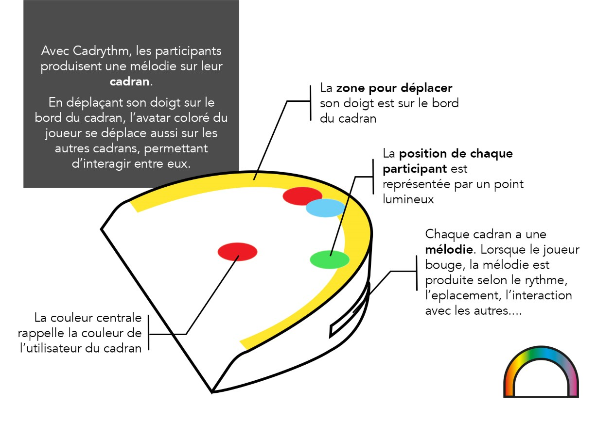
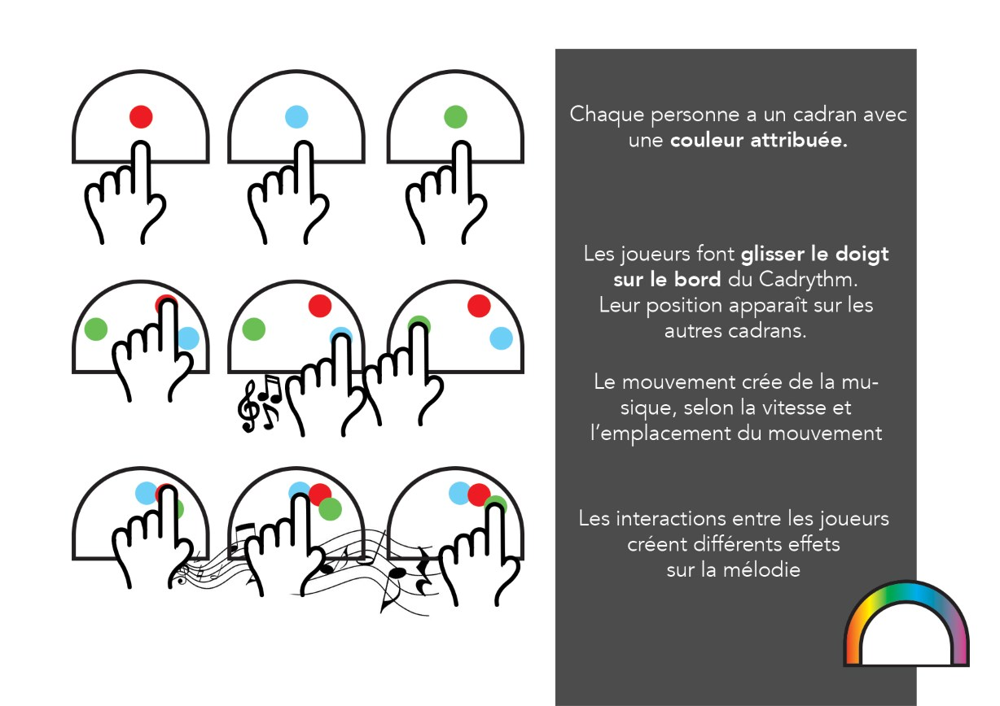

Cadrythm est un instrument de musique où la musique dépend des interactions entre les joueurs.
Dans ce projet, je devais construire un prototype avec une expérience sensitive
originale, en utilisant la technologie électronique Arduino, autour du thème
de l'**attention conjointe**.

**Cadrythm** prend la forme d'un cadran avec lequel on peut interagir. Son bord
est tactile et détermine ainsi la position du doigt lorsque celui-ci
le touche

**Plusieurs cadrans** sont **connectés entre eux** et la position de chacun
est indiquée sur chaque cadran, avec un indicateur lumineux.
Ainsi les autres personnes sont conscientes de la position d'autrui

Le déplacement du doigt crée une mélodie sur le cadran. La mélodie est
influencée par plusieurs paramètres :

- La **vitesse** de déplacement module le rythme
- L'**emplacement** module la hauteur de la musique
- Enfin, les **interactions** entre les différents joueurs modifient la mélodie,
par exemple s'ils se suivent ou se croisent, celle-ci peut devenir plus piano ou tonitruante

## Prototypage
Pour tester cette idée, j'ai construit un **prototype** avec des composants 
électroniques et une carte Arduino. 
Pour simplifier l'interaction avec le matériel à ma disposition, la position
des autres cadrans est indiquée avec un petit indicateur en papier, dont la
position est contrôlée par un servo-moteur. La surface tactile est limitée à 12 
touches capacitives.

    
    

            
Un cadran prototype, relié à une carte Arduino et un ordinateur.

    

Deux programmes ont été développés, le [code Arduino des cadran](https://github.com/TheoDel/cadrythm)
et le code Processing jouant la musique (le prototype nécessite donc 
un ordinateur pour fonctionner)

