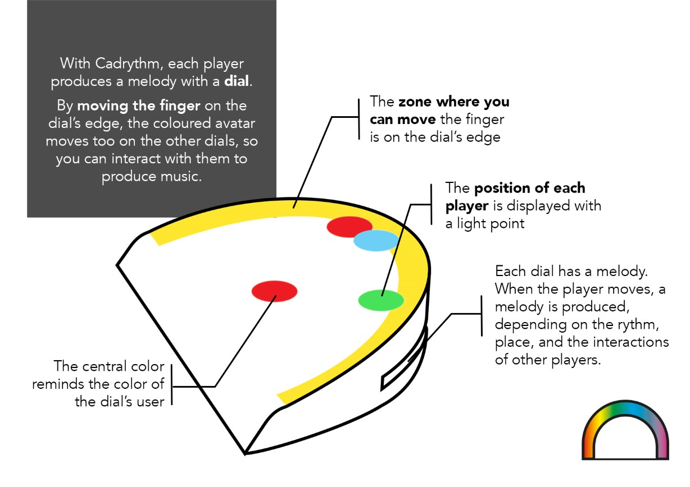
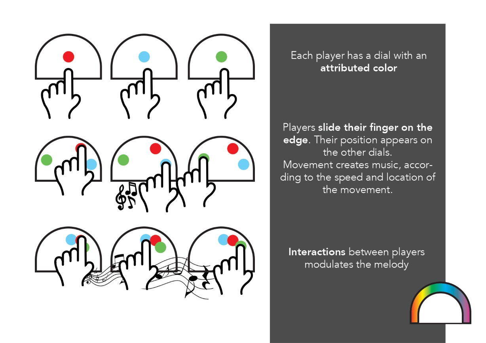

Cadrythm is a music instrument where the melody depends on the interactions between players.
In this project, I had to design a prototype with an original sensitive
experience, using the Arduino electronic technology, around the **joint attention** theme.

**Cadrythm** looks like an interactive dial. It edge is tactile, si it
can determine the position of the finger when it is touched.

**Several dials** are **connected between them** and the position of each
one is pictured on the others, with a indicator light.
In this way, the other players are conscious of each one position.

Each dial makes a melody when it is touched, the melody is influenced by
several parameters :

- The movement **speed** modulates the pace
- The **location** modulates the pitch
- Finally, **interactions** between the players modify the melody, for example
if they follow or cross, it becomes more piano or thunderous.

## Prototyping
In order to test this idea, I made a **prototype** with electronic components
and an Arduino card.

I simplified the interaction, with the available components :
Positions of other dials is shown with a paper indicator, whose position
is controlled with a servo-motor. The tactile surface is limited to 12 capacitive touch points.

    
    

            
A prototype dial, linked to an Arduino card and a computer.

    

Two programs have been developed, the [dial's Arduino code](https://github.com/TheoDel/cadrythm)
and the Processing code, playing the music (so the prototype needs a computer
to play the music)
