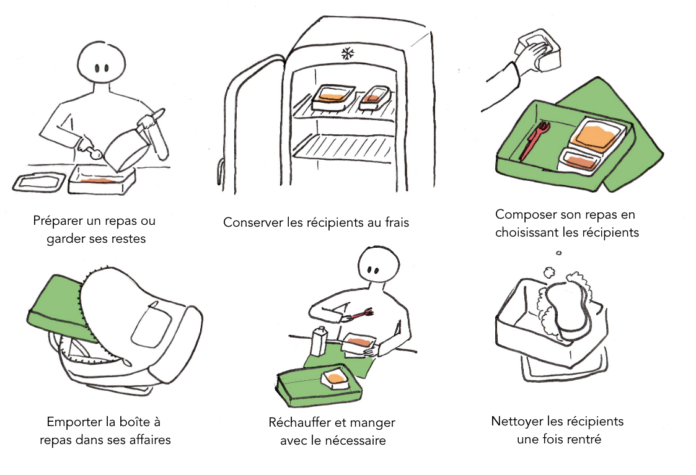
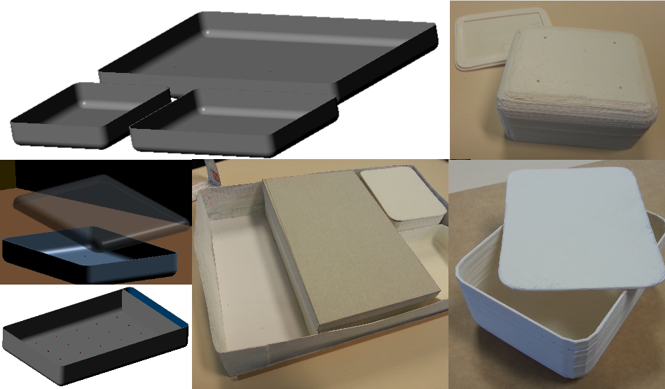

La CompoBoîte est une boîte repas pour facilement emporter à l'extérieur 
un repas préparé, à partir de ses restes alimentaires.

Dans ce **projet d'initiation au design produit**, nous devions concevoir un objet lié aux
boîtes repas. Ce projet simple illustre pourtant la complexité de la conception
d'un produit destiné à satisfaire et proposer des fonctionnalités à un utilisateur.

---

## Méthodologie

### Analyse du sujet et concept

Nous avons tout d'abord procédé à une large analyse du sujet, les boîtes repas :

- Quel est le contexte, ses utilisateurs, leurs motivations ?
- Quels sont les problèmes d'usage courants : encombrement, étanchéité, besoin de couverts...
- L'aspect sociétal et environnemental : anti-gaspillage, meilleur bilan 
environnemental que la nourriture à emporter, plaisir de la nourriture "faite maison"... 
- Le référentiel formel existant

Nous avons ensuite choisi un des persona proposés, celui d'un étudiant dont une des
contraintes principales est le manque de temps. Notre proposition voulait donc répondre
à une problématique "**_Comment gagner du temps sur son repas à emporter ?_**"

La CompoBoîte a 2 principaux composants :

- **Les compartiments** contenant la nourriture se substituent aux boîtes de
conservation traditionnelles, elles sont en différentes tailles mais de même hauteur.
- **La boîte**, plus grande, est utilisée pour composer son repas, au gré de 
son humeur et des restes disponibles en y rangeant les compartiments spécialement
conçus pour rentrer dedans, selon un système de grille.

      
      

        
Scénario d'utilisation de la CompoBoîte

      

En faisant des récipients de conservation les contenants à emporter, du temps
est ainsi gagné sur le rangement, le nettoyage, et ajoute un côté ludique
à la préparation du repas à emporter.

### Détails supplémentaires

Pour répondre à d'autres problèmes que nous avons relevés dans notre analyse,
la conception a pris en compte de nombreux détails :
- Une place est réservée dans la boîte pour des **couverts**.
- Un élastique maintient la boîte fermée en transport.
- Les récipients s'emboîtent dans des **picots au fond de la boîte** pour mieux les maintenir.
- Les récipients ont des **bords arrondis** pour en faciliter la saisie et mieux en finir le contenu.
- Le **couvercle** est **transparent**, pour facilement voir le contenu d'un récipient et éviter les pertes
- La taille est un problème pour le transport. Bien que l'objet soit volumineux,
il garde une épaisseur correcte, pouvant se ranger comme un ordinateur dans le sac.

### Matériaux, écoconception
Ce produit a été réfléchi en prenant en compte l'aspect d'écoconception, par
une observation de son cycle de vie. 

Bien que la fabrication et la fin du vie du produit aient un impact élevés, l'objet est
destiné à être utilisé de nombreuses fois, en faisant à long-terme 
un produit probablement plus responsable qu'un emballage jetable.

#### Matériaux principaux utilisés
- **PBT** : Plastique solide et résistant aux variations de températures, pour 
le fond des récpients et la boîte. Son inconvénient est néanmoins qu'il n'est
aujourd'hui pas recyclable.
- **Polypropylène** : Plastique souple transparent recyclable, utilisé pour les
couvercle des récipients

### Prototypage 
Nous avons rapidement prototypé notre objet (carton, modélisation puis imprimante 3D)
pour en vérifier le fonctionnement et les dimensions. Suite à quoi, nous avons revu
des points de détail (dimensionnement, prise en main...)

      
      

        
Modélisations et maquettes de la CompoBoîte

      

