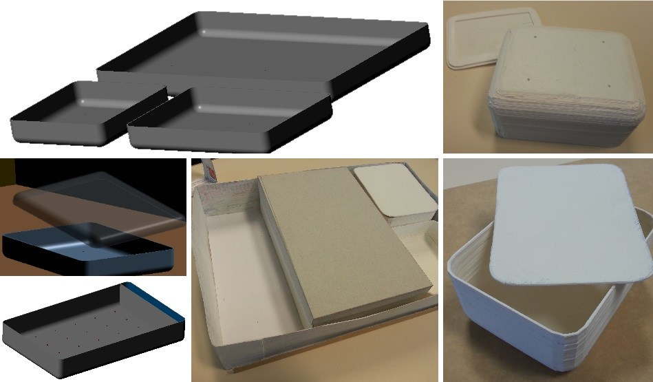

The CompoBoîte ("Composable Box") is a lunchbox made to easily take away a
meal prepared at home, from leftovers.

In this **project of introduction to industrial design**, we had to design an object related to the
lunchboxes. This simple project nevertheless illustrates the complexity of designing
a product to satisfy and provide functionality to a user.

---

## Methodology

### Analysis of the subject and concept

We first analysed our subject, the lunchboxes :

- What are the context of use, the users, theirs motivations ?
- What are the main problems with existing products : need of cutlery, congestion, tightness...
- The environmental and societal aspect : anti-waste, more environmental than the takeaway food, the pleasure of the "homemade" food...
- The existing formal references

      
      

        
Scenario of a classic lunchbox use

      

We then picked a persona among the ones proposed : a student whose main
constraint is the lack of time. Our proposition is then based on the problem
"**_How to save time on the takeaway?_**"

The CompoBoîte has 2 main components :

- **The compartments** containing food, replacing the usual storage boxes,
they have different sizes but the same height.
- **The box**, larger, is used to compose the meal, with the available leftovers stored
in the compartments. These ones are made to fit in the box, with a grid system.

      
      

        
Scenario of the CompoBoîte

      

The storage boxes are directly carried out, some time is then spared on washing,
storage, and is a ludic way to prepare the meal.

### Additional details

In order to answer some other problems raised in our analysis, we designed a
lot of other details :

- There is a compartment in the box for **cutlery**
- An elastic keeps the box closed.
- Containers fit into the **pins at the bottom of the box**, for a better support.
- Containers have **rounded edges** for a better handling, and ease finishing the food.
- **Covers** of containers are **transparent**, to see their content and avoid waste.
- The size is a problem for transportation. Even though the object is large, it depth
stays correct and can slip into a bag, like a computer.

### Materials, eco-design
This product has been designed by taking eco-design in account, with an observation
of it product lifecycle.

Even though the manufacturing and the end of life have an high impact, it is
intended to be used many times, so it long term sustainability is certainly better
than disposable packaging of takeaway food.

#### Main materials used
- **PBT** : Tough plastic, heat resistant, for the box and the bottom of compartments.
aux variations de températures, pour
le fond des récpients et la boîte. Its disadvantage is however that it is
not recyclable.
- **Polypropylene** : transparent soft plastic recyclable, used for the lid.

### Prototyping
We quickly prototyped our object (cardboard, numerical modelling then 3D printer)
to check it functioning and dimensions. As a result, we remade some details
(improving handling, dimensioning...)

      
      

        
Modelling and models of the CompoBoîte

      

