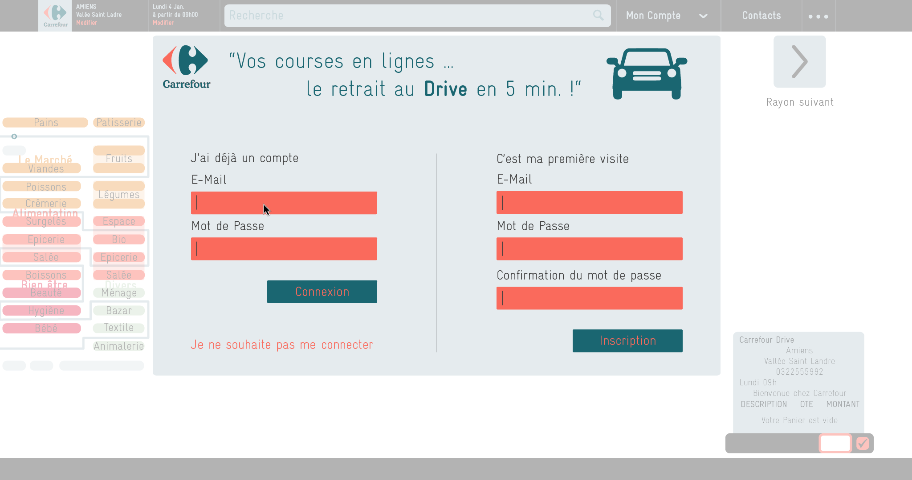
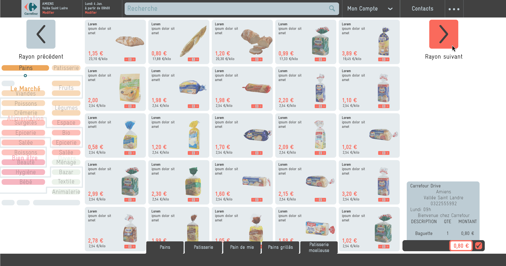
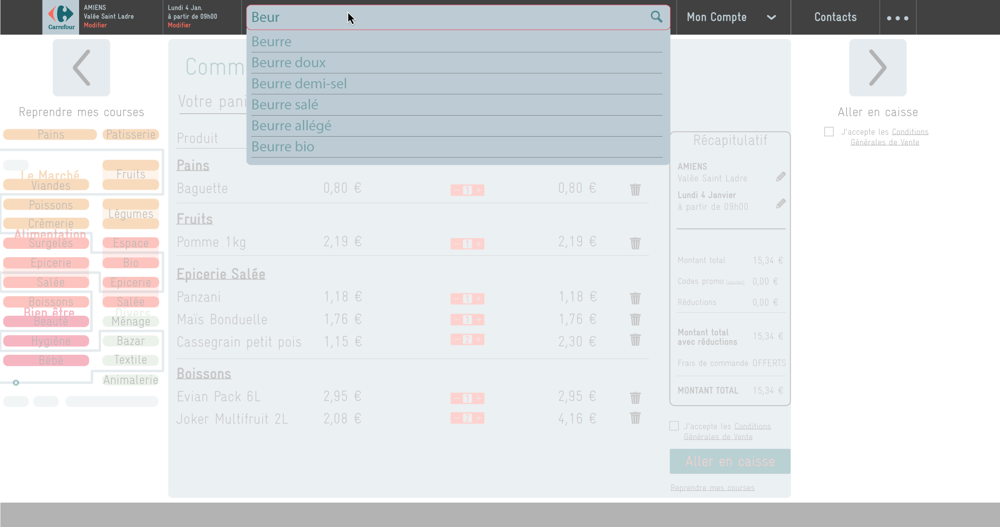
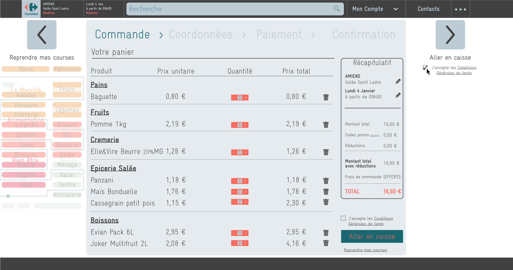
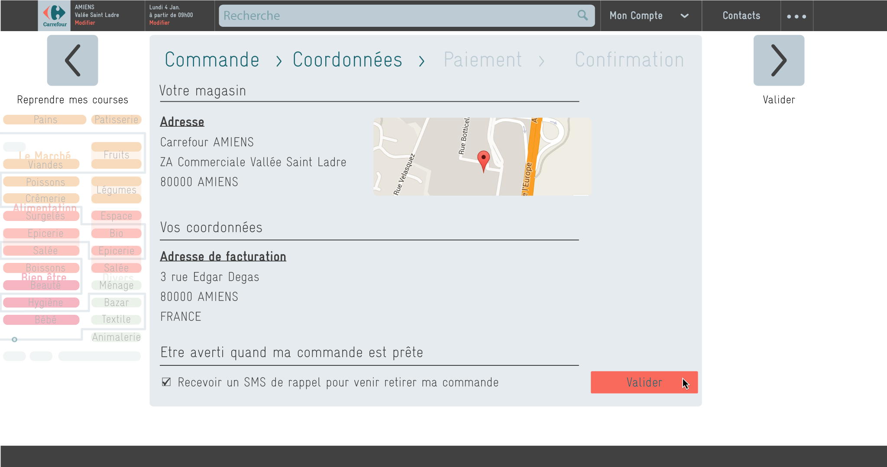

Nous avons dans ce projet **observé de nouveaux utilisateurs** face au service de **courses en ligne**
du "Drive", en relevant les points fonctionnels et à améliorer.
Celui-ci regroupe 2 parties : 
- La commande en ligne des produits, le choix du moment de retrait.
- Le retrait physique dans le magasin en voiture.

A partir de ces observations, nous avons formulé des pistes d'améliorations et des
propositions pour l'interface de la commande.

_(Ce projet a été réalisé en-dehors de toute demande de la chaîne de magasin choisie, ici, Carrefour.)_

---

## Méthodologie

* **Etude préalable** : historique du service, état du marché, avantages/inconvénients, utilisateurs directs/indirects...
* Etablissement d'un **protocole d'observation** (sur la commande et le retrait)
    * **Scénarios** : instructions types (ajouter un produit, passer la commande)
    * **Notes d'observations** : attitude, erreurs, remarques verbales...
    * **Questions après l'utilisation** : ressentis, appréciations
    * **Evaluation quantifiée** par les sujets : graphisme, plaisir, simplicité
* **Séances de test** avec un panel de 5 nouveaux utilisateurs, de différents âges et niveaux d'utilisation d'internet.
* Compilation des **résultats**
* Vérification des **critères d'ergonomie** (Bastien, J.M.C., Scapin, D.)
* Propositions d'améliorations
* **Maquettage** de nouvelles interfaces

## Résultats et propositions

Les résultats des tests ont montré que les principaux problèmes venaient lors de la
commande en ligne, alors que le retrait se passait sans encombre. Nous avons donc
concentré notre réflexion sur la commande en ligne.

      
      

        
Extraits des résultat de l'évaluation quantifiée par les utilisateurs. Si l'on ne peut évidemment pas tirer de
        statistiques chiffrées avec ce panel, on observe néanmoins de façon générale de nettes difficultés 
        d'utilisation sur la partie web

      

Les **principaux soucis** sont liés à la différence entre un magasin physique et numérique :
un design du site jugé généralement _trop complexe_, la difficulté pour _trouver un produit_
et à _estimer leur taile_ réelle.

De nouvelles fonctionnalités ont donc été proposés pour améliorer l'expérience du site Drive :
* Représenter les rayons de l'interface sous forme spatialisée d'un plan : les utilisateurs sont plus
susceptibles de se retrouver dans des rayons qui sont représentés comme ceux qu'ils connaissent
dans les magasins physiques.
* Proposer un service "tour du magasin" : afin de ne rien oublier, le site peut guider
l'utilisateur à travers chaque rayon avec une gamme de produits, comme il le ferait dans un magasin physique
* Revoir le graphisme avec un code couleur réduit et signifiant
* Optimiser la barre de recherche (problème technique) avec auto-complétion et la classification des produits

Nous avons donc créé une nouvelle maquette de site web essayant d'intégrer ces recommandations :

  <!-- Indicators -->
  <ol class="carousel-indicators">
    <li data-target="#carousel-drive" data-slide-to="0" class="active"></li>
    <li data-target="#carousel-drive" data-slide-to="1"></li>
    <li data-target="#carousel-drive" data-slide-to="2"></li>
    <li data-target="#carousel-drive" data-slide-to="3"></li>
    <li data-target="#carousel-drive" data-slide-to="4"></li>
  </ol>

  <!-- Wrapper for slides -->
  

    

      
      

        Ecran de connexion
      

    

    

      
      

        Dans le parcours du magasin (dont le plan est à gauche), on peut
        visiter chaque rayon à la suite. Le panier prend la forme d'un ticket 
        de caisse (en bas à droite)
      

    

    

      
      

        La barre de recherche permet de revenir chercher un objet oublié ou non trouvé
      

    

    

      
      

        L'écran de validation prend la forme du ticket de caisse.
      

    

    

      
      

        Un écran confirme le lieu et heure de retrait avant le paiement.
      

    

    
  

  <!-- Controls -->
  <a class="left carousel-control" href="#carousel-drive" role="button" data-slide="prev">
    
    Previous
  </a>
  <a class="right carousel-control" href="#carousel-drive" role="button" data-slide="next">
    
    Next
  </a>

