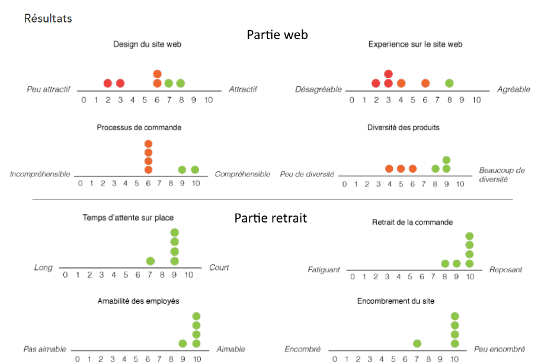
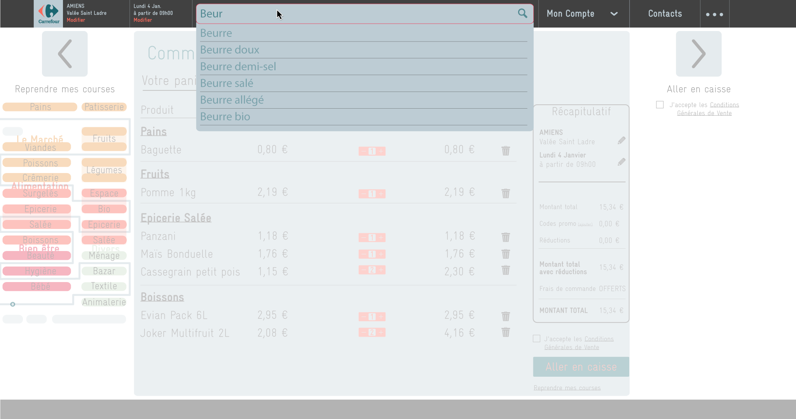
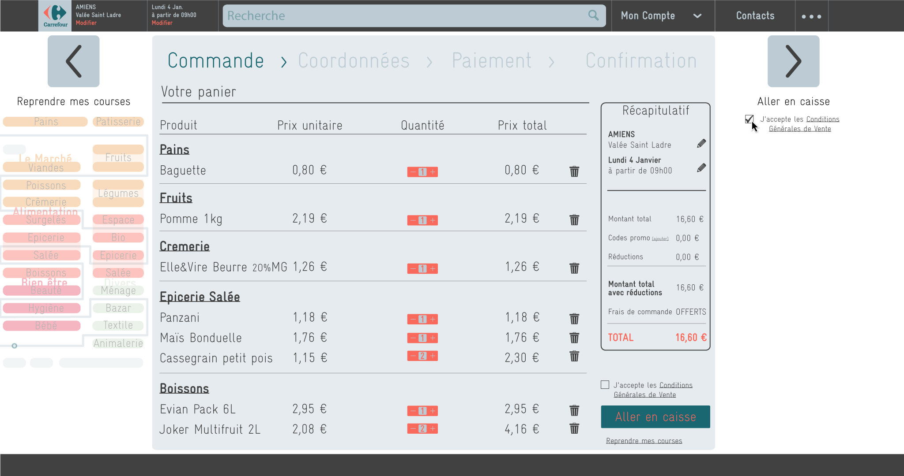
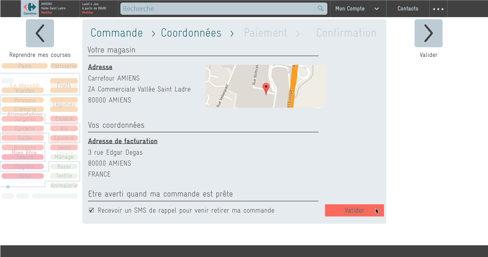

In this project, we **observed new users** with the **"Drive" online ordering service**,
noting the functional parts and possible improvements.
This service has two parts :
- The online ordering, with the withdrawal moment choice
- The physical withdrawal at the shop, in car

With these observations, we gave some improvement tracks and proposals for
the ordering interface.

_(This project was made outside of any order of the chosen retail chain, in this case, Carrefour.)_

---

## Methodology

* **Prior study** : history of the service, state of the market, pros and cons, direct/incidental users...
* Writing a **observation protocol** (on the order and the withdrawal)
    * **Scenarios** : typical instructions (add a product, confirm the command)
    * **Observations notes** : attitude, errors, verbal comments...
    * **Questions after the use** : feelings, appreciations
    * **Quantified evaluations** by the user : graphic design, simplicity, pleasure...
* Running the **testing sessions** with a panel of 5 new customers, of different ages and level of internet using.
* Compiling the **results**
* Checking the **ergonomic criteria** (Bastien, J.M.C., Scapin, D.)
* Enhancement proposals
* **Wireframing** of new interfaces

## Results and proposals

The tests results showed that the main problems happened during the online order,
but the physical withdrawal occurred without problem. We then focused our reflexion
on the online order.

      
      

        
Extracts of the quantified evaluation results by the users. 
        Of course, we can't draw some statistics with this reduced panel,
        but we clearly see some problems on the web part.

      

The **main problems** are linked to the inherent difference between a physical
and online market : the website is judged _too complex_, it's difficult to _find
a product_ and to estimate their _actual size_.

New features have then been proposed to enhance the user experience of the Drive website :

- Display the products categories on a map : users are more likely to find products if they're
represented in the same way as their physical store.
- Suggest a "shop tour" : the website can guide through each section so he's less
likely to forget something, just as in a real shop.
- Redesign the website with a significant and reduced color code.
- Optimize the product classification and search bar (technical problem) with an auto-completion feature.

So we created a new model of website trying to integrate these recommendations:

  <!-- Indicators -->
  <ol class="carousel-indicators">
    <li data-target="#carousel-drive" data-slide-to="0" class="active"></li>
    <li data-target="#carousel-drive" data-slide-to="1"></li>
    <li data-target="#carousel-drive" data-slide-to="2"></li>
    <li data-target="#carousel-drive" data-slide-to="3"></li>
    <li data-target="#carousel-drive" data-slide-to="4"></li>
  </ol>

  <!-- Wrapper for slides -->
  

    

      
      

        Ecran de connexion
      

    

    

      
      

        In the shop tour (whose map is on the left), the user can visit each section.
        The basket takes the form of a receipt (on the bottom right).
      

    

    

      
      

        If the user forget or didn't find a product, they can use the search bar.
      

    

    

      
      

        The validation screen looks like a receipt.
      

    

    

      
      

        A screen validates the moment and location of withdrawal before the payment.
      

    

    
  

  <!-- Controls -->
  <a class="left carousel-control" href="#carousel-drive" role="button" data-slide="prev">
    
    Previous
  </a>
  <a class="right carousel-control" href="#carousel-drive" role="button" data-slide="next">
    
    Next
  </a>

