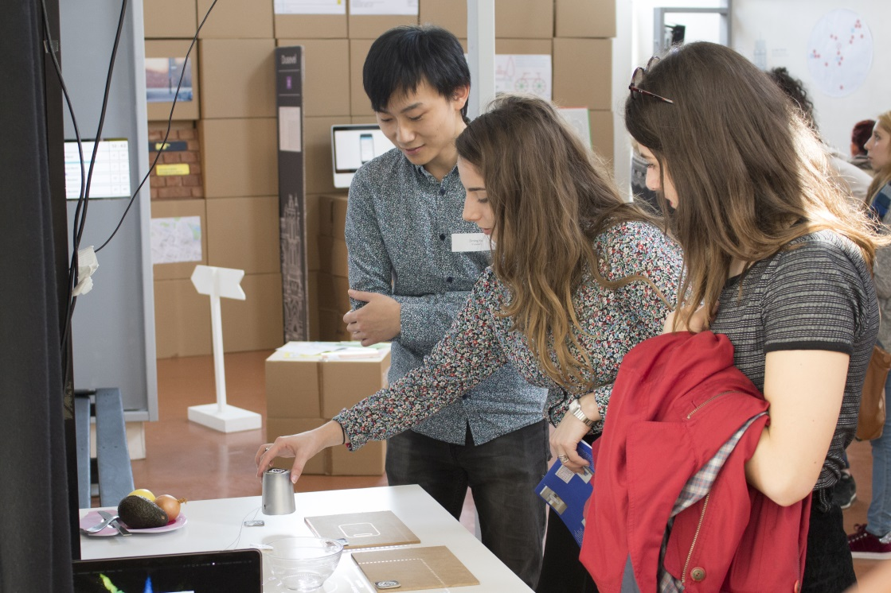

<i class="fa fa-flask" aria-hidden="true"></i>
&nbsp; Ce projet est actuellement en développement !

QUICOOK est un dispositif de réalité augmentée pour la cuisine. Il permet
de préparer une recette en suivant des instructions projetées sur le plan
de travail. La juxtaposition des étapes à suivre à côté des gestes de
l'utilisateur fait en temps réel indique la marche à suivre et enseigne
par démonstration. L'élaboration de la recette peut être réalisée par
plusieurs participants en même temps. Le dispositif distinguera l'avancement
de chacun d'eux. La notion de partage dans ce projet est donc double. Au-delà
du partage de recette qu'apporte les réseaux type réseaux sociaux, par du
texte, image ou vidéo, Quicook permet en plus une confection collaborative
de la recette. Ce dispositif est particulièrement adapté pour des ateliers
de cours de cuisine en groupe.

Une caméra et un vidéo projecteur sont fixés au-dessus du plan de travail.
L'interaction homme machine passe par des capteurs posés sur le plan de
travail et sur les ustensiles. La caméra suit chaque capteur et le vidéo-projecteur
fournit les informations, texte ou vidéo de démonstration, au fur et à
mesure de l'avancement de la recette. L'utilisateur n'a plus qu'à suivre
les indications projetées au plus près de son geste et perfectionner sa
pratique par imitation.

---

## Méthodologie détaillés

### Recherche et inspiration

A quoi pourrait ressembler le plaisir de cuisiner demain ? A l'heure où les
objets connectés, plus ou moins convaincants, veulent se multiplier, nous
avons voulu explorer un aspect souvent délaissé, celui du partage, de la
collaboration lors de la confection, de la transmission du savoir-faire
culinaire.

Nous avons observé les usages en situation, dans la vie de tous les jours, puis
organisé en groupe une scéance de brainstorming autour du sujet de la
cuisine, pour y trouver l'inspiration. Nous en avons tiré deux personas
proches des préoccupations que nous souhaitions aborder.

(brainstorming, persona)

### Scénarisation de situations

Nous nous sommes concentrés sur un objet de l'apprentissage et de la préparation,
le support de la recette (livre, ordinateur, tablette...), et avons dessiné des
courts scénarios des problèmes que nos personnas pourraient rencontrer avec, ainsi
que le scénario idéal pour résoudre ce problème "dans le meilleur des mondes".
Les difficultés à comprendre des indications, le manque de place sur un
plan de travail, la rupture constante entre la lecture d'une recette et son
application, autant de petites gênes identifiées dans cette étape.

Ensuite, nous avons imaginé des solutions concrètes et réalisables,
indépendemment les unes des autres, pour toutes ces frustrations. Des concepts
similaires se sont dégagés de ces idées, que nous avons regroupées pour
baser nos concepts.

(Scénarisation des usages)

### Concepts

Pour mieux guider l’usager dans sa recette, nous souhaitons rendre ses
mouvements identifiables et lui retourner l'information nécessaire.

Après sélection, nous avons donc choisi notre concept :
Un plan de travail reconnaissant des interactions simples avec une caméra
et projetant des informations. Représenter une recette
sur un plan spatialisé et de façon temporelle permet de donner la bonne
information au bon moment, et représenter des tâches
qui peuvent être faites en même temps par différentes personnes, ajoutant notre
dimension participative désirée.

Nous voulions aussi tirer parti de la dimension communautaire grace à internet, en
permettant de partager des astuces ou de nouvelles recettes, et que ces dernières
soient dynamiquement adaptées à la situation de l'utilisateur : ingrédients en
réserve, régime alimentaire particulier, etc...

La veille de l'existant nous a fait trouver des projets similaires par exemple
chez [IKEA](https://www.youtube.com/watch?v=qD60cBQOABY) ou
[Whirlpool](https://www.youtube.com/watch?v=rYiD8PBDpOk), qui furent une
intéressante source d'inspiration. Nous nous en distinguons néanmoins
par notre parti-pris collaboratif et la faisabilité technique immédiate
de notre concept.

### Prototypage des interactions et de l'interface

Pour imaginer concrètement quelles interactions pourraient être disponibles
sur la table, nous avons prototypé, avec un tableau à feutre et des accessoires,
les étapes de la réalisation d'une recette avec notre dispositif telles que nous
les avons imaginées en premier temps.

(Première maquette réalisée sur un tableau)

Ces étapes ont ensuite été formalisées plus précisément sous la forme d'un
"flow" d'application, précisant les interactions disponibles selon la situation.

(Flot des interactions dans l'application)

### Tests d'utilisation

Nous avons rapidement fait tester à des premières personnes notre concept pour
recueillir leurs impressions sur le concept, la logique et l'intuitivité des interactions.
Sur le même principe que notre première réalisation, nous avons utilisé le
"prototype tableau".
Selon les actions de nos testeurs avec leurs accessoires de cuisine,
nous dessinions sur le tableau les changements d'interface.

( Test utilisateur avec prototype "quick and dirty")

Pour les testeurs, nos interactions étaient trop dirigistes et contraignantes :
par exemple, nous avions oublié de prendre en compte la place des accessoires
inutilisés et ils souhaitaient plus de flexibilité dans la façon de procéder.

En tenant compte de ces retours, nous avons modifié le flot d'interaction
afin de créer un premier prototype plus tangible.

(Deuxième version de maquette)

### Identité visuelle

Bien qu'il ne représente qu'une partie secondaire du projet, nous avons un peu
étudié l'identité visuelle de notre projet. Pour la rapprocher au plus près
de nos utilisateurs nous avons construit une planche tendance d'après
l'environnement de nos personas, la famille urbaine de 30-40 ans.

Cette planche nous a orienté pour décider des lignes directrices du design
graphique utilisé pour la projection, en tenant compte des
contraintes imposées par la projection. Un design épuré aux couleurs claires,
aux lignes franches, moderne avec une inspiration rétro.
L'imagerie est contourée et plate, sans perspective ou volume, presque
[enfantine] (http://images.nintendolife.com/news/2010/06/get_cute_and_fluffy_with_miffys_world_on_wiiware/attachment/0/large.jpg)

(image de maya)

### Prototype de MVP et présentation

Ne pouvant développer toutes les fonctionnalités pensées dans un premier prototype,
nous avons recentré les fonctionnalités sur la préparation de la recette :

- Afficher plusieurs taches de préparation en même temps pour plusieurs utilisateurs
- Les descriptions des étapes sont projetées et suivent les ustensiles concernés
- L'utilisateur valide les étapes effectuées pour progresser avec un objet physique

Notre premier prototype a été développé avec le moteur Unity. Techniquement, des QR codes
sont posés sur les ustensiles afin d'en déterminer la position, la reconnaissance
des codes étant gérée avec la bibliothèque [Reactivision](http://reactivision.sourceforge.net/).
L'image est ensuite projetée grâce à un vidéo-projecteur suspendu au-dessus de
la table. Un palet servant de controleur et permettant de "cliquer" a été ajouté
pour controler l'avancement.

Ce prototype a été présenté comme projet de fin d'étude et lors des journées portes
ouvertes à l'ESAD (école supérieure d’art et de design) d'Amiens. À chaque fois, ces
présentations ont été des occasions de recueillir des pensées, impressions, retours
d'utilisation nécessaires pour continuer le développement du projet.

      
      

        
Démonstration du concept et du prototype lors des journées portes ouvertes à l'ESAD (école supérieure d’art et de design) d'Amiens

      

