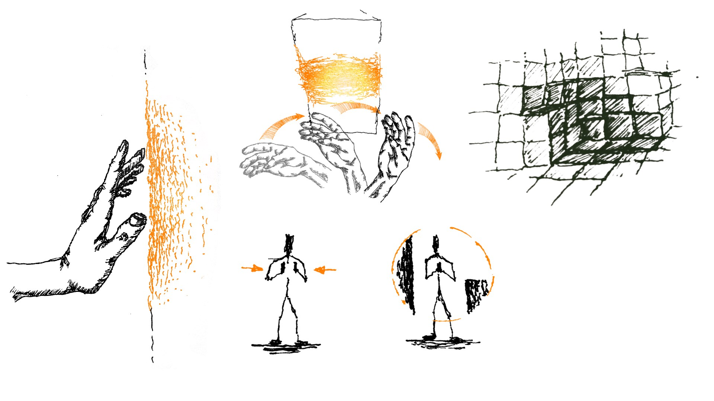
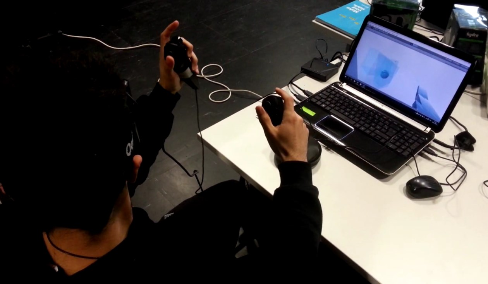

How to get your bearings in a space you can only perceive through your movements ?

**revell** is a **virtual reality** project where the user is immerged in
an environment with invisible surfaces. Without their usual senses,
they can reveal the surrounding world through physical gestures and actions:
The surfaces are initially invisible, but when the user hands touch them, they
become visible. The perceptive feedback is then visual and not haptic.

<i class="fa fa-trophy" aria-hidden="true">
</i>&nbsp;<b>revell</b> won the <b>Prix "Virtual Fantasy award" at <a href="http://www.laval-virtual.org/">Laval Virtual</a></b>.

Laval Virtual is a leader international exhibition on virtual technologies and uses.
Our project was presented during the exhibition, then awarded among a dozen student
projects in the demo category. The jury loved the original physical and cognitive
engagement our project transmits !

Technically, we used Razer Hydra controllers, reproducing the hand movements and positions
in the virtual environment. Finally, the Oculus Rift is used to transcribe head movements
on the avatar.

---

## Project Methodology

### Searching a concept

Inspired by the cognitive sciences theories about spatial perception, we
wanted to build an experience where the user would have a perception similar to
a blind person. He should then use now movements to be guided.

      
      

        
Sketches of the imagined concepts : reveal surfaces by (virtual) touch,
         use the echo sound, subdivide the world in voxels... (Drawings from A.Delval)

      

### Development
Considering our technical and temporal constraints, we reduced the interactions
to the most important : touching surfaces with the virtual hands. The game engine
a been then developed with Unity3D.

      
      

        
The world modeled on Unity, the result of it transformation into
        cubes (voxels), the collision zones on the player and the first real time
        screenshots of the game.

      

### User testing
To collect the players feelings, we ma

Pour recueillir les ressentis que pouvaient avoir les joueurs, we did test with
voluntary. With these observations, we saw adjustments were needed, just as the
need of a tutorial to discover the commands.
This feedback contributed to an enhanced version, presented at Laval Virtual.

      
      

        
User testing session

      

