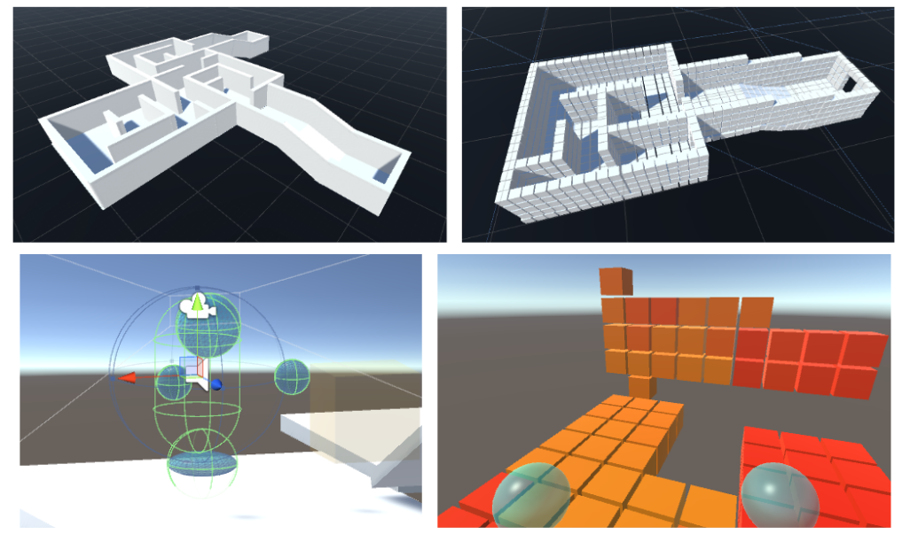
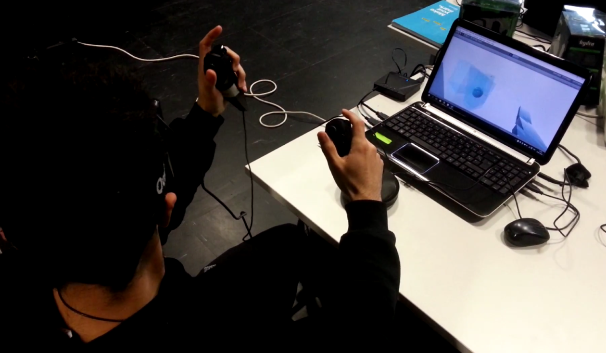

Comment se repérer dans un espace que l'on ne peut percevoir que par ses mouvements ?

**revell** est un projet de **réalité virtuelle** dans lequel l'utilisateur 
est immergé à la première personne dans un environnement constiué d'obstacles initialement invisibles.
Sans ses repères perceptifs habituels, l'utilisateur peut révéler le monde 
l'entourant, à travers ses gestes physiques et ses actions :
Les surface de l'environnement virtuel sont au début invisibles, mais quand 
les mains de l'utilisateur les touchent, elles deviennent visibles. Le retour
est donc uniquement visuel et non haptique.

<i class="fa fa-trophy" aria-hidden="true">
</i>&nbsp;<b>revell</b> a gagné le <b>Prix "Virtual Fantasy award" au salon <a href="http://www.laval-virtual.org/">Laval Virtual</a></b>, auquel il
a été présenté au grand public.

Laval Virtual est un salon international des technologies de réalité virtuelle et de ses applications. 
Notre projet a été présenté et nommé gagnant parmi une douzaine de projets étudiant dans la catégorie démo. 
Le jury  a particulièrement aimé l'engagement corporel que doit avoir l'utilisateur dans cette expérience.

Cette possibilité est offerte par les controlleurs Razer Hydra qui reproduisent les mouvements et positions des mains dans l'environnement virtuel. 
Enfin, le casque Oculus Rift transcrit les mouvements de têtes sur le personnage virtuel.

---

## Méthodologie du projet
### Recherche de concept
Inspirés par les théories de sciences cognitives sur la perception spatiale, nous 
sommes partis de l'idée d'une expérience où l'utilisateur aurait des capacités
similaires à celles d'une personne aveugle et devrait utiliser des nouveaux
mouvements pour se repérer.

      
      

        
Schémas des concepts imaginés en amont du projet : révéler les 
        surfaces par le toucher (virtuel), utiliser le son comme écho,
        sous-diviser le monde à révéler en voxels... (Dessins A.Delval)

      

### Développement
Avec les limitations techniques et de temps, nous avons réduit les interactions à
la plus importante, celle de toucher des surfaces avec les mains. Le moteur 
du jeu a ensuite été développé avec Unity3D.

      
      

        
Aperçus du monde modélisé sur Unity, le résultat de sa transformation en
        cubes (voxelization), les zones de collision du joueur et un des
        premiers aperçus du jeu en temps réel

      

### Tests utilisateurs
Pour recueillir les ressentis que pouvaient avoir les joueurs, nous l'avons
fait tester à des volontaires. De ces observations sont ressortis le besoin d'effectuer des
ajustements et l'ajout nécessaire d'un guidage pour prendre en main les commandes.
Ces retours ont contribués à une version améliorée, présentée au salon Laval Virtual.

      
      

        
Séance de test d'utilisation 

      

