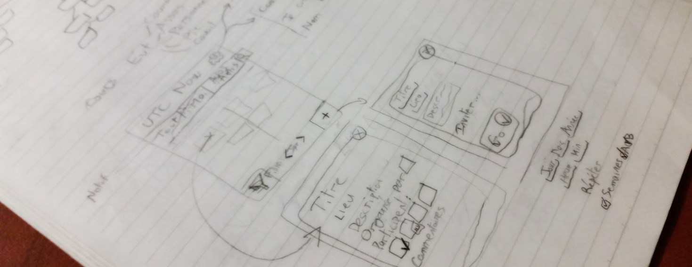

**UTC Now** is a **mobile application** project. This agenda centralizes all the
events occuring at the University of Technology of Compiègne. They can come from
institutional events, timetables, associations, or even suggested by students themselves.

The goal was to offer a centralized and live representation of the multiple events,
encouraging serendipity and facilitation the organization of students life with this platform.

---

## Project Methodology

### Concept and prior study

With our initial idea, we collected the **ideas and expectations of students**,
with an **online survey**. We drew some complementary ideas that could be developed
in future updates (view the available classrooms, parking spaces...)

### Wireframing
The sketching of the app screens was made with the reflexion about elements
structures and the basic features. I then used inVision to simulate the behaviour
of the application use.

      
      

        
Wireframes and interactions on the main screens

      

### Development
The development was made with Ionic, for it multiplatform deployment sufficient
for our needs and the popularity of this framework. At the same time, a part
of the team developed an API for the events data, and a server made to retrieve
the events on the UTC website and databases.

  <!-- Indicators -->
  <ol class="carousel-indicators">
    <li data-target="#carousel-utcnow-final" data-slide-to="0" class="active"></li>
    <li data-target="#carousel-utcnow-final" data-slide-to="1"></li>
  </ol>

  <!-- Wrapper for slides -->
  

    

      
      

      

    

    

      
      

      

    

  

  <!-- Controls -->
  <a class="left carousel-control" href="#carousel-utcnow-final" role="button" data-slide="prev">
    
    Previous
  </a>
  <a class="right carousel-control" href="#carousel-utcnow-final" role="button" data-slide="next">
    
    Next
  </a>

