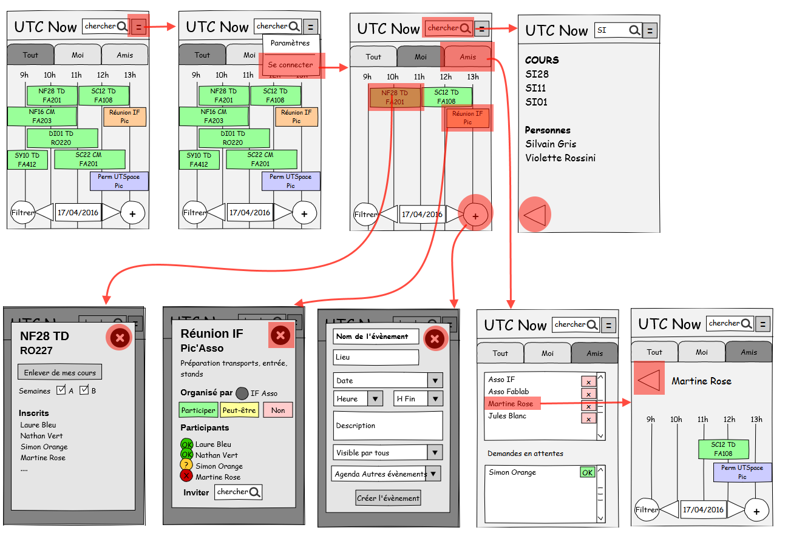
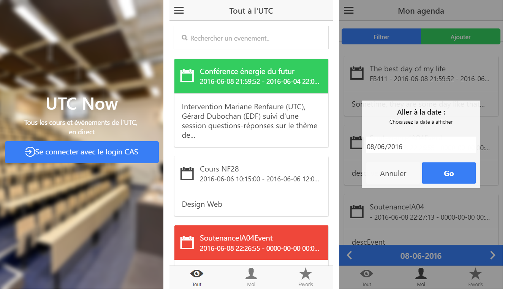
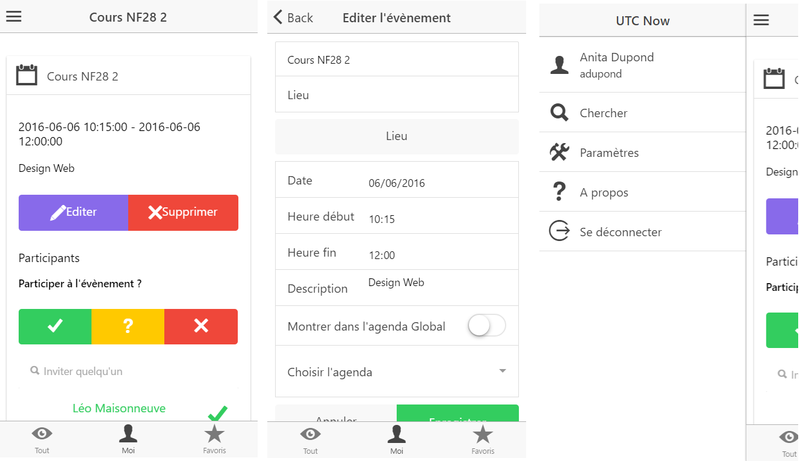

**UTC Now** est un projet d'**application mobile** d'agenda centralisant 
tous les évènements de l'Université de Technologie de Compiègne.
Ceux-ci peuvent être issus des évènements officiels (conférences, 
vie de l'établissement...), des emplois du temps, ou même proposés par les
utilisateurs via l'application.

L'objectif était d'offrir une représentation centralisée et en direct de la multitude 
d'évènements simultanés tout en favorisant l'organisation et la sérendipité 
de la vie étudiante, sportive, associative... via cette plateforme.

---

## Méthodologie
### Concept et étude préalable
Outre le concept de départ de représenter tous les évènements de l'UTC (et ce
sur différents supports: appli, webTV..), nous avons recueilli des **idées
et attentes des étudiants**, grâce à un **questionnaire en ligne**. De celui-ci nous
avons ainsi tiré de nombreuses idées complémentaires qui auraient pu être
développées en ajout dans le futur (aperçu des places de parking, des salles
de cours libres...)

### Maquettage
La création de maquettes s'est faite conjointement avec une réflexion sur 
l'onthologie des éléments et des fonctionnalités de base. L'utilisation
d'invision a ensuite permis de simuler le comportement de l'utilisation
de l'application.

      
      

        
Maquette et interactions des écrans principaux

      

### Développement
Le développement a été fait avec ionic, pour son déploiement multi-plateforme 
suffisant à nos besoins et la popularité de ce framework. Conjointement à
l'application, une partie de l'équipe a développé une API pour 
gérer les données des évènements et un serveur pour récupérer indépendemment 
les évènements sur les portails de l'UTC.

  <!-- Indicators -->
  <ol class="carousel-indicators">
    <li data-target="#carousel-utcnow-final" data-slide-to="0" class="active"></li>
    <li data-target="#carousel-utcnow-final" data-slide-to="1"></li>
  </ol>

  <!-- Wrapper for slides -->
  

    

      
      

      

    

    

      
      

      

    

  

  <!-- Controls -->
  <a class="left carousel-control" href="#carousel-utcnow-final" role="button" data-slide="prev">
    
    Previous
  </a>
  <a class="right carousel-control" href="#carousel-utcnow-final" role="button" data-slide="next">
    
    Next
  </a>

