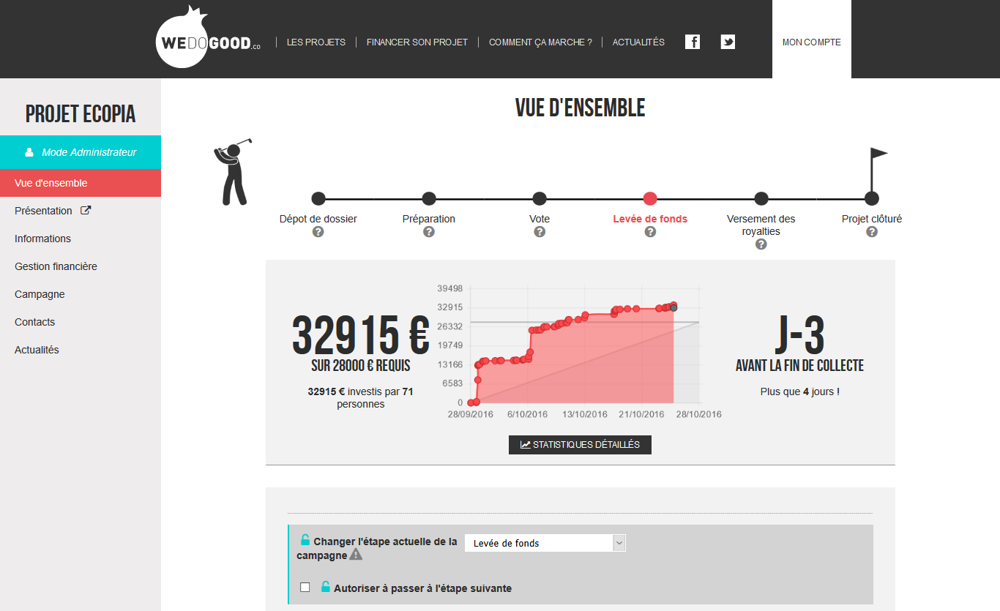
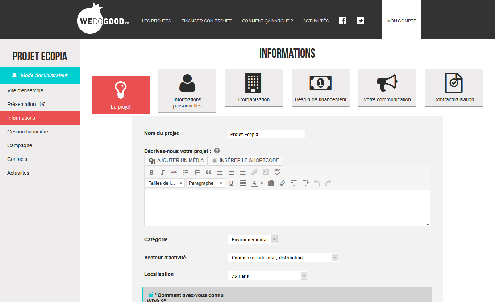
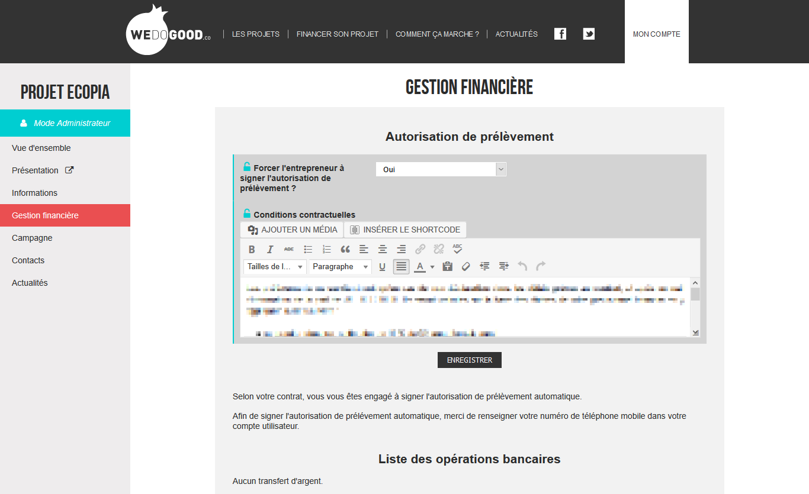
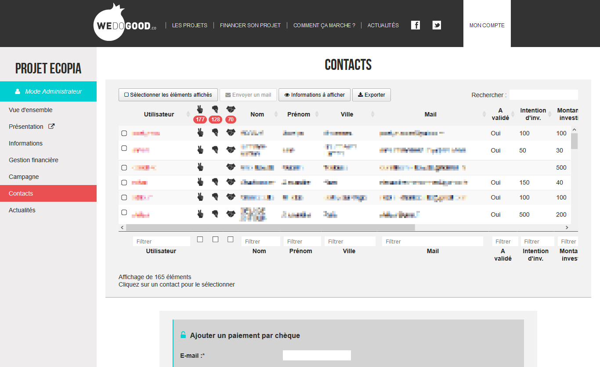

  <!-- Indicators -->
  <ol class="carousel-indicators">
    <li data-target="#carousel-wdg" data-slide-to="0" class="active"></li>
    <li data-target="#carousel-wdg" data-slide-to="1"></li>
    <li data-target="#carousel-wdg" data-slide-to="2"></li>
    <li data-target="#carousel-wdg" data-slide-to="3"></li>
  </ol>

  <!-- Wrapper for slides -->
  

    

      
      

      

    

    

      
      

      

    

    

          
          

          

    

    

          
          

          

    

  

  <!-- Controls -->
  <a class="left carousel-control" href="#carousel-wdg" role="button" data-slide="prev">
    
    Previous
  </a>
  <a class="right carousel-control" href="#carousel-wdg" role="button" data-slide="next">
    
    Next
  </a>

 

Suite à mon stage de fin de Licence avec la plateforme de financement participatif 
de [WE DO GOOD](http://www.wedogood.co), j'ai en 2016 travaillé deux mois pour 
effectuer une refonte de cet outil. Celle-ci a mené de sa conception à une
partie fonctionnelle de son développement.
Celui-ci est destiné aux porteurs de projets pour monitorer et gérer leur
levée de fonds. 

En arrivant, la réflexion sur le parcours client global et la structure du
tableau de bord avait été menée. La refonte devait amener une meilleure
prise en main et guider les porteurs de projet pour les inciter à l'utiliser
et faciliter ainsi le travail de l'équipe d'accompagnement.
Le choix des outils à intégrer s'est fait avec une observation des habitudes
de travail de ces derniers.

Le tableau de bord a ainsi pris la forme d'une webapp traditionnelle,
permettant de jongler d'un outil à l'autre.