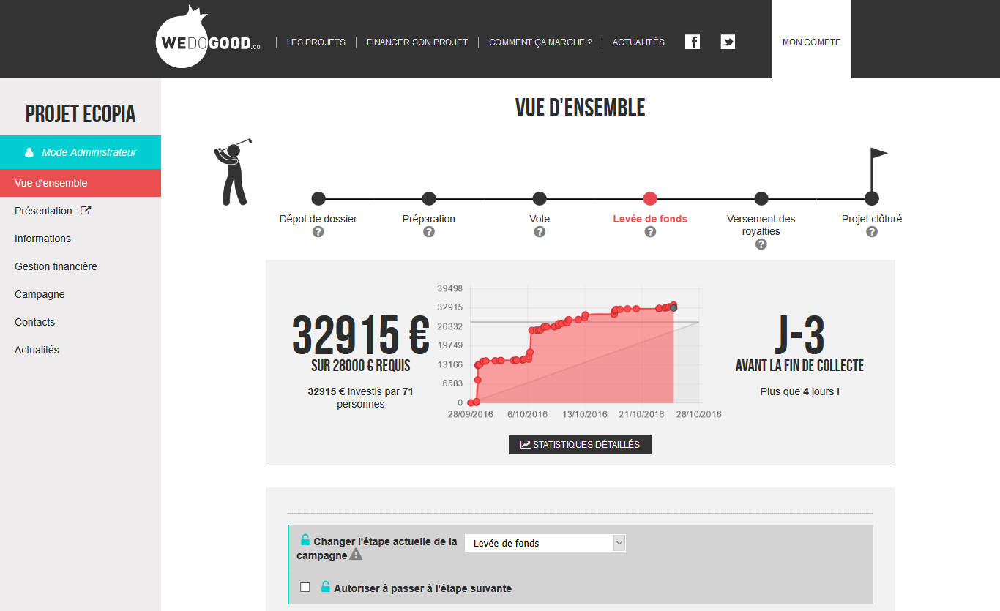

  <!-- Indicators -->
  <ol class="carousel-indicators">
    <li data-target="#carousel-wdg" data-slide-to="0" class="active"></li>
    <li data-target="#carousel-wdg" data-slide-to="1"></li>
    <li data-target="#carousel-wdg" data-slide-to="2"></li>
    <li data-target="#carousel-wdg" data-slide-to="3"></li>
  </ol>

  <!-- Wrapper for slides -->
  

    

      
      

      

    

    

      
      

      

    

    

          
          

          

    

    

          
          

          

    

  

  <!-- Controls -->
  <a class="left carousel-control" href="#carousel-wdg" role="button" data-slide="prev">
    
    Previous
  </a>
  <a class="right carousel-control" href="#carousel-wdg" role="button" data-slide="next">
    
    Next
  </a>

 

After my 2015 internship with the crowdfunding platform [WE DO GOOD](http://www.wedogood.co),
I worked two months in 2016 to redesign this tool, through it conception to
the develoment of a functional part of it.
This dashboard is directed to the project creators, where they can monitor
and manage their online fundraising.

When I arrived, the reflexion about the customer path and the dashboard structure
had already been made. The redesign had to give a better learning time and guide
the project creators, in order to facilitate the WE DO GOOD support team.
The choice of tools to integrate was made with observations of their job habits.

The dashboard then took a more traditional webapp appearance, where users
can juggle with a tool or another.
